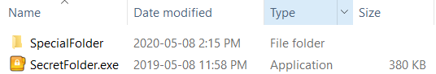
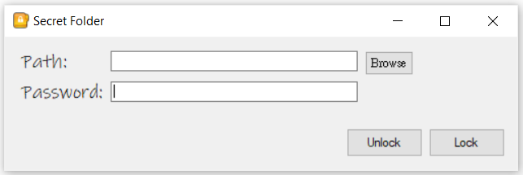
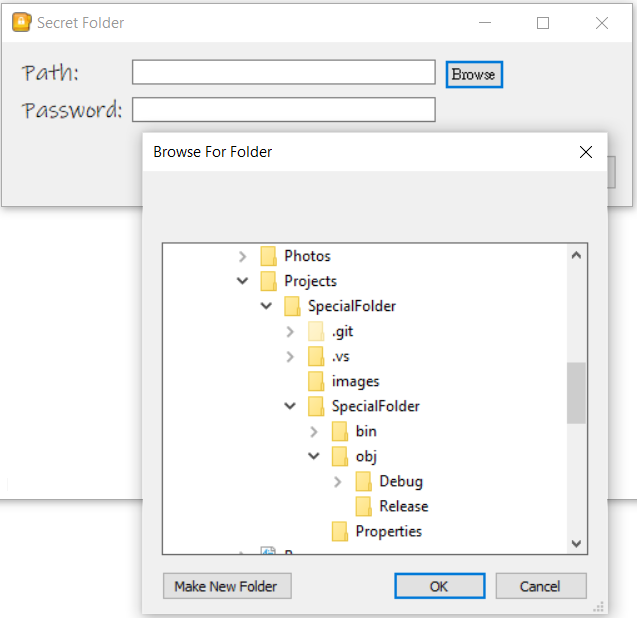
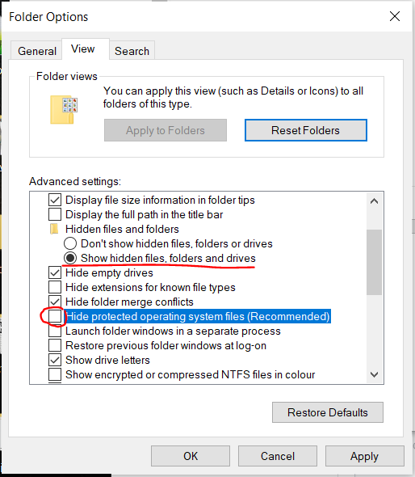

# SpecialFolder
SpecialFolder is a simple app to hide your folder with a password

## Installation
1. clone or download to your local directory (your_dir)
2. open and build using <a href="https://visualstudio.microsoft.com/" target="_blank">Visual Studio</a>
3. SpecialFolder.exe should be created and can be found in your_dir/SpecialFolder/SpecialFolder/bin/Debug/SecretFolder.exe 


## Usage
### IMPORTANT!!! 
YOU MUST remember the exact 'path' and 'password' to unhide/unlock the folder, you wont be able to find the path of the folder by 'browse' or using File Explore when you need to unlock it! 
### To hide a folder
1. Start the app


2. click on 'browse' and select the folder/file you wish to make it "special"


3. type in password

4. click 'Lock'

### To unhide a hidden folder
1. type in the absolute path of the hidden folder(ex. C:/Users/user/hidden_folder_name)

2. type in password and click unlock

## How it works?
If you have been browsing into hiding a folder with a password, you probably have watched youtube video or tutorial on writing a batch file ([example](others/HideFolder.bat)) to do so. 
This app does pretty much the same thing, but with an executable, user interface, more flexible and easier to use!

In the batch file example:
The folder was renamed into something else by
```batch
ren folder_name "name_when_hidden"
```
Then the next two lines are the secret of how it works!

basically it sets the attribute (attrib) of all the subfolder and files within (/s /d) the folder with hidden (+h) and system (+s), then does it again for the folder itself
```batch
attrib +h +s /s /d "name_when_hidden\*"
attrib +h +s "name_when_hidden"
```
However I did not rename the folder, as it will cause trouble when hiding multiple folder within the same directory without a custom hidden name function. (see [Some improvements that can be done](#some-improvements-can-be-done))

If you ever forgot/miss-typed the password or path and can't retrieve the files in a hidden folder (either from a batch file or this app), don't panic.

Open your [File Explore] > select [View] > click on [Options] > then goto [View] tab, select [show hidden files, folders and drives] and uncheck [hide protected operating system files (Recommended)], and navigate to original location to find your hidden folder.


## Some improvements can be done
1. Move the app from the original location to '/Windows/System32/'. 

My thought of this is because the folder have operating system attribute when hidden and there are tons of folder and file in System32, which makes the hidden folder harder to find!

2. Change the file name to some encrypted name but doesn't conflict. Basically, every hidden folder will be assigned with a new name that seems random to people, but the app can retrieve the hidden folder name.
perform something like <a href="https://www.online-toolz.com/tools/text-encryption-decryption.php" target="_blank">Encrypt & Decrypt Text</a>


## License
[MIT](https://choosealicense.com/licenses/mit/)
